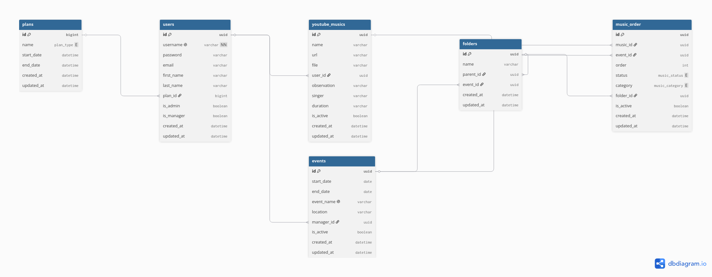
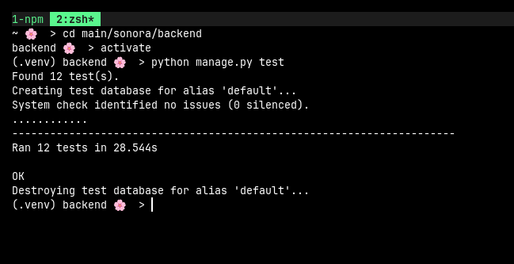
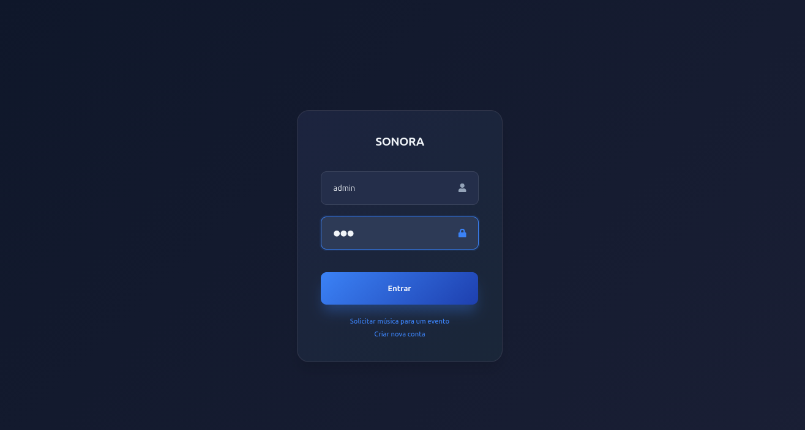
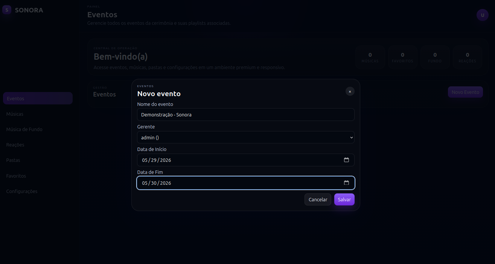
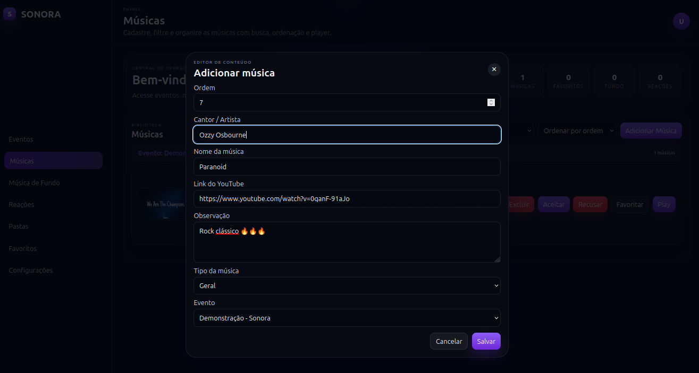
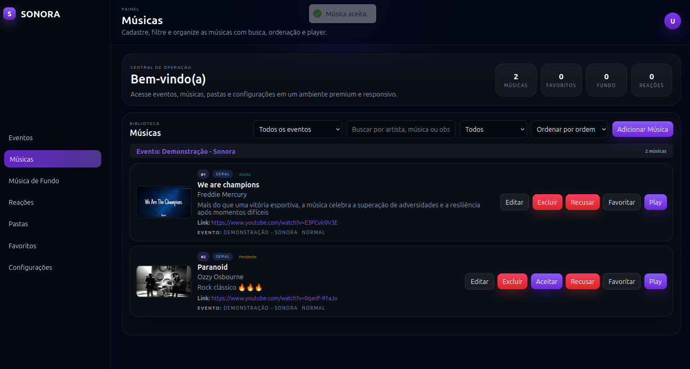

# Sonora

## Índice

* [Sobre o Projeto](#sobre-o-projeto)
* [Equipe](#equipe)
* [Estrutura do Projeto](#estrutura-do-projeto)
* [Tecnologias Utilizadas](#tecnologias-utilizadas)
* [Como Clonar ou Baixar](#como-clonar-ou-baixar)
* [Como Executar o Projeto](#como-executar-o-projeto)
* [Sprint 2](#sprint-2)

  * [Testes](#testes)
  * [MVP](#mvp)
* [Status do Projeto](#status-do-projeto)

---

## Sobre o Projeto

### Sonora

O **Sonora** é uma plataforma para gerenciamento de músicas em eventos, permitindo que organizadores criem eventos, recebam sugestões musicais dos participantes e controlem a aprovação e a reprodução das faixas.


### Descrição
Gerenciador e reprodutor de áudio para organização de eventos.


## Equipe

* Ariadne Silva
* Arthur Queiroz
* Cassio Costa
* Vitor Rayan
* Victor Silva

---

## Estrutura do Projeto

```text
sonora/
│
├── backend/
│   ├── run.sh
│   ├── run.ps1
│   ├── manage.py
│   ├── requirements.txt
│   └── ...
│
├── frontend/
│   ├── src/
│   ├── public/
│   ├── package.json
│   └── ...
│
└── README.md
```

### Organização

* **backend/** → API REST desenvolvida em Django e Django REST Framework.
* **frontend/** → Interface web desenvolvida em React e TypeScript.
* **README.md** → Documentação principal do projeto.

---

## Tecnologias Utilizadas

### Backend (API REST)

* Python 3.12
* Django 5.2.14
* Django REST Framework 3.17.1
* Django Simple JWT 5.5.1

### Frontend

* TypeScript
* React 19
* Vite 8
* React Hot Toast
* React Icons
* ESLint

---

## Como Clonar ou Baixar

Você pode obter este repositório de três formas.

### Clonar via HTTPS


```bash
git clone https://github.com/ariadnec-es/sonora.git
```

### Clonar via SSH


```bash
git clone git@github.com:ariadnec-es/sonora.git
```

### Baixar como ZIP

1. Acesse o repositório no GitHub.
2. Clique no botão **Code**.
3. Selecione **Download ZIP**.
4. Extraia o conteúdo em uma pasta de sua preferência.

---

## Como Executar o Projeto

### Backend

Acesse a pasta do backend:

```bash
cd backend
```

#### Linux/macOS

```bash
chmod +x run.sh
./run.sh
```

#### Windows PowerShell

```powershell
.\run.ps1
```

Os scripts são responsáveis pela configuração e inicialização da API localmente.

---

### Frontend

Acesse a pasta do frontend:

```bash
cd frontend
```

Siga as instruções descritas no próprio diretório do frontend para instalação das dependências e execução da aplicação.

Exemplo comum:

```bash
npm install
npm run dev
```

---

###  Database


## Sprint 2

### Testes

Foram desenvolvidos testes de integração da API utilizando uma classe base de configuração (`BaseTestSetup`) herdando de `APITestCase` do Django REST Framework.

#### Validação e Renovação de Plano

Condição de acesso: possuir plano ativo.

```python
class TestPlanMiddlewareAndRenewal(BaseTestSetup):
    ...
```

#### Autenticação, Eventos e Permissões

Validação de login, criação de eventos e regras de acesso.

```python
class TestViewPermissions(BaseTestSetup):
    ...
```

#### Ordenação de Músicas

Garantia de que as músicas adicionadas mantenham corretamente a ordem definida.

```python
class TestMusicOrderLogic(BaseTestSetup):
    ...
```



---

### MVP

#### Login

Usuário previamente cadastrado realiza autenticação na plataforma.



---

#### Criar Evento

Usuário com perfil de administrador cria um novo evento.



---

#### Adicionar Música

Adição de músicas ao evento por meio de URL do YouTube.



---

#### Aprovação de Música

Gerente aprova ou rejeita músicas enviadas para o evento.



---

## Status do Projeto

🚧 Em desenvolvimento

* Sprint 2 concluída.
* MVP funcional implementado.
* Novas funcionalidades previstas para as próximas sprints.
