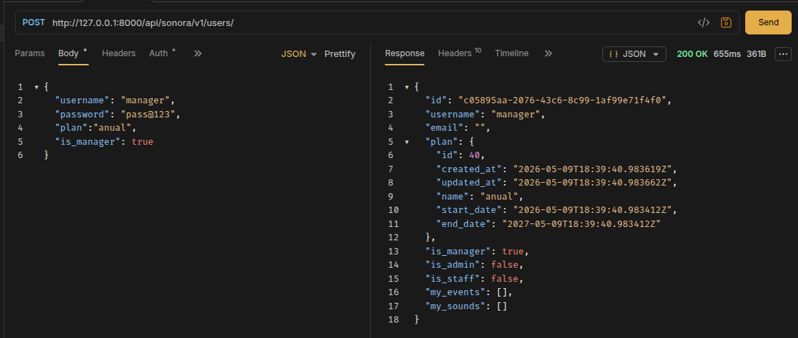
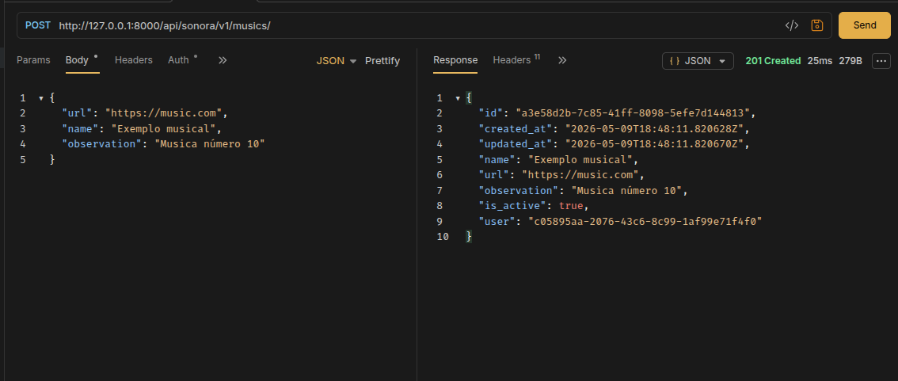
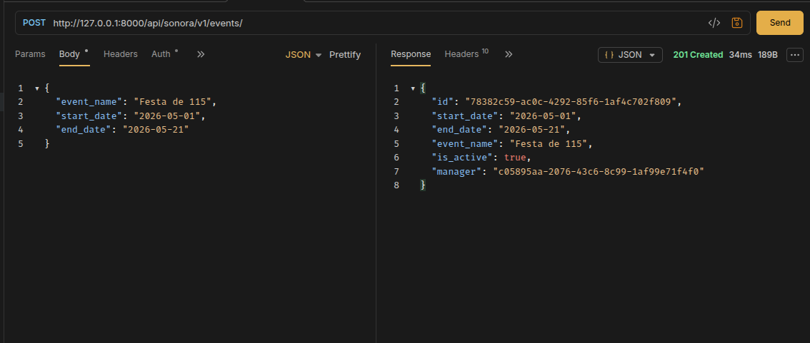
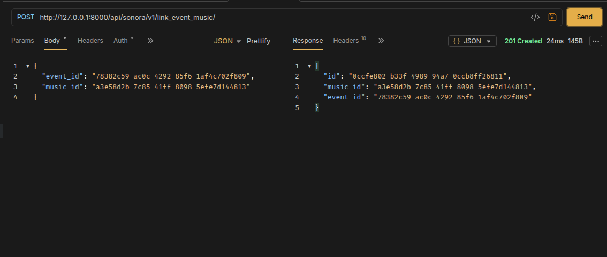

# 🎵 Documentação do Projeto SonoraAPI

Bem-vindo à documentação do backend do projeto Sonora. Esta API foi construída com **Django** e **Django REST Framework**, utilizando **JWT** para autenticação e **UUIDs** como identificadores únicos.

## 📋 Pré-requisitos

Antes de começar, certifique-se de ter instalado em sua máquina:
*   Python 3.10 ou superior
*   Pip (gerenciador de pacotes do Python)
*   Node.js (opcional, para testes com o script JS)

---

### Scrips de Auxílio

- `Execute (linux)`
```bash
chmod +x run.sh; ./run.sh
```
Descrição: O arquivo `run.sh` é um script que automatiza a execução do servidor Django. 

- `Execute (windows)`
```powershell
.\run.ps1
```
Descrição: O arquivo `run.ps1` é um script que automatiza a execução do servidor Django. 

- Caso algum processo não funcione abaixo contém um passo a passo de como fazer


## ⚙️ Configuração do Ambiente (Servidor Django)

### 1. Clonar o repositório e configurar ambiente virtual

**No Linux / macOS:**
```bash
python3 -m venv venv
source venv/bin/activate
```

**No Windows (PowerShell):**
```powershell
# Cria o ambiente virtual
python -m venv venv

# Ativa o ambiente virtual
.\venv\Scripts\activate
```
*Nota: Se o PowerShell bloquear a execução, rode `Set-ExecutionPolicy -ExecutionPolicy RemoteSigned -Scope Process` e tente ativar novamente.*

### 2. Instalar dependências
O comando é o mesmo para todos os sistemas:
```bash
pip install -r requirements.txt
```

### 3. Configurar variáveis de ambiente
No Windows, você pode criar o arquivo `.env` usando o Bloco de Notas ou o VS Code.
1. Na raiz do projeto, crie um arquivo chamado `.env`.
2. Cole as configurações:
   ```env
   SECRET_KEY=sua_chave_secreta_aqui
   DEBUG=True
   ```

### 4. Rodar Migrações
```bash
python manage.py makemigrations sonoraAPI
python manage.py migrate
```

### 5. Criar Administrador
```bash
python manage.py createsuperuser
```
*O terminal pedirá nome de usuário, e-mail e senha. A senha não aparece enquanto você digita por segurança.*

### 6. Iniciar o servidor
```bash
python manage.py runserver
```
---

## 🤖 Testando com o Script JS (Windows)

Se você estiver usando o **VS Code no Windows**:

1. **Instalar Node.js:** Baixe a versão *LTS* em [nodejs.org](https://nodejs.org/).
2. **Preparar o ambiente:**
   Abra o terminal na pasta do projeto e rode:
   ```powershell
   npm init -y
   npm install dotenv node-fetch
   ```
3. **Executar o script:**
   ```powershell
   node example.get_users.js
   ```

---

### ⚠️ Dicas de Problemas Comuns no Windows:

*   **Comando `python` não encontrado:** No Windows, o comando pode estar mapeado como `py` em vez de `python`. Tente `py -m venv venv` se o primeiro falhar.
*   **Permissões de Script:** O Windows é rigoroso com scripts. Se ao tentar ativar o `venv` você vir um erro em vermelho sobre "Scripts desabilitados", o comando `Set-ExecutionPolicy` mencionado no passo 1 resolve isso.
*   **Caminhos:** Ao configurar o `MEDIA_ROOT` no `settings.py`, o Django no Windows lida bem com `BASE_DIR / 'media'`, mas evite usar caminhos fixos com barras invertidas (`C:\Users\...`), sempre prefira usar o `pathlib` do Django (`BASE_DIR`).
*   **Banco de Dados:** O SQLite funciona perfeitamente no Windows sem precisar instalar nenhum servidor externo. Se decidir migrar para MySQL no futuro, recomendo usar o **Docker** ou o **XAMPP** para facilitar a instalação do servidor MySQL no Windows.
---

## 🔌 Como consumir a API

A API segue o padrão RESTful. Abaixo, os principais endpoints:

### Autenticação
*   **POST** `/api/token/`: Envie `username` e `password`. Retorna o `access` (token JWT).
*   **POST** `/api/token/refresh/`: Envie o `refresh` token para obter um novo token de acesso.

### Recursos (Endpoints principais)
Para acessar estes endpoints, você deve enviar o token JWT no cabeçalho da requisição:
`Authorization: Bearer <seu_token>`

| Método | Endpoint | Descrição |
| :--- | :--- | :--- |
| `GET` | `/api/sonora/v1/users/` | Lista usuários (Admin apenas). |
| `GET` | `/api/sonora/v1/musics/` | Lista músicas do usuário logado. |
| `POST` | `/api/sonora/v1/musics/` | Cria uma nova música. |
| `GET` | `/api/sonora/v1/events/` | Lista eventos (apenas os futuros). |

---

## 🤖 Testando com o Script JS

Se você deseja testar a comunicação programaticamente, use o script `example.get_users.js`:

1. **Instalar dependências:**
   ```bash
   npm init -y
   npm install dotenv node-fetch
   ```

2. **Configurar `.env`:**
   Crie um `.env` com `API_URL`, `API_USERNAME` e `API_PASSWORD`.

3. **Executar:**
   ```bash
   node example.get_users.js
   ```

---

## 💡 Regras de Negócio Importantes

*   **Deleção Segura:** Não existe deleção física (Hard Delete). Ao deletar via API, o sistema apenas altera o status para `is_active = False`.
*   **Filtro de Eventos:** Gerentes apenas visualizam eventos cuja data (`end_date`) seja igual ou superior à data de hoje.
*   **Permissões:**
    *   **Admin:** Acesso total a tudo.
    *   **Gerente (Staff):** Pode gerenciar eventos vinculados a ele.
    *   **Usuário Comum:** Acesso restrito ao próprio perfil e músicas vinculadas.

---

**Consulte o arquivo `models.py` para ver os campos exatos de cada recurso.**


- Adminstrador cria gerente. (POST: /api/sonora/v1/users/)




- Gerente faz login (nome de usuario e senha) (POST: /api/token/)


- Gerente adiciona musica (POST: /api/sonora/v1/musics/)




- Cria evento (por padrão, o evento criado é vinculado ao gerente que o criou) (POST: /api/sonora/v1/events/)




- Vínculo entre musicas e evento (POST: /api/sonora/v1/link_event_music/)




- Informações do próprio usuário (GET: /api/sonora/v1/users/)

```JSON
[
  {
    "id": "c05895aa-2076-43c6-8c99-1af99e71f4f0",
    "username": "manager",
    "email": "",
    "plan": {
      "id": 40,
      "created_at": "2026-05-09T18:39:40.983619Z",
      "updated_at": "2026-05-09T18:39:40.983662Z",
      "name": "anual",
      "start_date": "2026-05-09T18:39:40.983412Z",
      "end_date": "2027-05-09T18:39:40.983412Z"
    },
    "is_manager": true,
    "is_admin": false,
    "is_staff": false,
    "my_events": [
      {
        "id": "0ccfe802-b33f-4989-94a7-0ccb8ff26811",
        "event_id": "78382c59-ac0c-4292-85f6-1af4c702f809",
        "music_id": "a3e58d2b-7c85-41ff-8098-5efe7d144813",
        "event_name": "Festa de 115",
        "music_name": "Exemplo musical",
        "url": "https://music.com"
      }
    ],
    "my_sounds": [
      {
        "created_at": "2026-05-09T18:45:05.001802Z",
        "updated_at": "2026-05-09T18:45:05.001836Z",
        "id": "e0411112-0420-4a47-a112-2d1a1611a97a",
        "name": "Exemplo musical",
        "url": "https://musics.com",
        "user_id": "c05895aa-2076-43c6-8c99-1af99e71f4f0",
        "observation": null,
        "is_active": true
      },
      {
        "created_at": "2026-05-09T18:48:11.820628Z",
        "updated_at": "2026-05-09T18:48:11.820670Z",
        "id": "a3e58d2b-7c85-41ff-8098-5efe7d144813",
        "name": "Exemplo musical",
        "url": "https://music.com",
        "user_id": "c05895aa-2076-43c6-8c99-1af99e71f4f0",
        "observation": "Musica número 10",
        "is_active": true
      }
    ]
  }
]
```

# Database
- Diagrama de entidades (dbml: https://dbdiagram.io/)
```dbml

Table plans {
  id integer [pk, increment]
  name varchar(50) [not null]
  start_date datetime
  end_date datetime
  created_at datetime [not null]
  updated_at datetime [not null]
}

Table users {
  id uuid [pk]
  username varchar(150) [not null]
  password varchar(128) [not null]
  first_name varchar(150)
  last_name varchar(150)
  email varchar(254)
  is_staff boolean [default: false]
  is_superuser boolean [default: false]
  is_active boolean [default: true]

  plan_id integer [ref: > plans.id]
  is_admin boolean [default: false]
  is_manager boolean [default: false]
}

Table youtube_musics {
  id uuid [pk]
  name varchar(100) [not null]
  url varchar(255) [not null]
  user_id uuid [ref: > users.id]
  observation varchar(255)
  is_active boolean [default: true]
  created_at datetime [not null]
  updated_at datetime [not null]

  indexes {
    (name, url) [unique]
  }
}

Table events {
  id uuid [pk]
  start_date date [not null]
  end_date date [not null]
  event_name varchar(100) [not null]
  manager_id uuid [ref: > users.id]
  is_active boolean [default: true]
  created_at datetime [not null]
  updated_at datetime [not null]
}

Table link_event_musics {
  id uuid [pk]
  music_id uuid [not null, ref: > youtube_musics.id]
  event_id uuid [not null, ref: > events.id]
  is_active boolean [default: true]
  created_at datetime [not null]
  updated_at datetime [not null]

  indexes {
    (event_id, music_id) [unique]
  }
}

```
- SQL:
```SQL
CREATE DATABASE IF NOT EXISTS sonoradb;
USE sonoradb;

CREATE TABLE IF NOT EXISTS plans (
    email VARCHAR(254) NULL,
    is_staff BOOLEAN DEFAULT 0,
    is_superuser BOOLEAN DEFAULT 0,
    is_active BOOLEAN DEFAULT 1,
    date_joined DATETIME DEFAULT CURRENT_TIMESTAMP,

    plan_id INTEGER NULL,
    is_admin BOOLEAN DEFAULT 0,
    is_manager BOOLEAN DEFAULT 0,

    FOREIGN KEY (plan_id)
        REFERENCES plans(id)
        ON DELETE SET NULL
);


CREATE TABLE IF NOT EXISTS youtube_musics (
    id CHAR(36) PRIMARY KEY,
    name VARCHAR(100) NOT NULL,
    url VARCHAR(255) NOT NULL,
    user_id CHAR(36) NULL,
    observation VARCHAR(255) NULL,
    is_active BOOLEAN DEFAULT 1,
    created_at DATETIME NOT NULL DEFAULT CURRENT_TIMESTAMP,
    updated_at DATETIME NOT NULL DEFAULT CURRENT_TIMESTAMP,

    UNIQUE(name, url),

    FOREIGN KEY (user_id)
        REFERENCES users(id)
        ON DELETE SET NULL
);


CREATE TABLE IF NOT EXISTS events (
    id CHAR(36) PRIMARY KEY,
    start_date DATE NOT NULL,
    end_date DATE NOT NULL,
    event_name VARCHAR(100) NOT NULL,
    manager_id CHAR(36) NULL,
    is_active BOOLEAN DEFAULT 1,
    created_at DATETIME NOT NULL DEFAULT CURRENT_TIMESTAMP,
    updated_at DATETIME NOT NULL DEFAULT CURRENT_TIMESTAMP,

    FOREIGN KEY (manager_id)
        REFERENCES users(id)
        ON DELETE CASCADE
);


CREATE TABLE IF NOT EXISTS link_event_musics (
    id CHAR(36) PRIMARY KEY,
    music_id CHAR(36) NOT NULL,
    event_id CHAR(36) NOT NULL,
    is_active BOOLEAN DEFAULT 1,
    created_at DATETIME NOT NULL DEFAULT CURRENT_TIMESTAMP,
    updated_at DATETIME NOT NULL DEFAULT CURRENT_TIMESTAMP,

    UNIQUE(event_id, music_id),

    FOREIGN KEY (music_id)
        REFERENCES youtube_musics(id)
        ON DELETE CASCADE,

    FOREIGN KEY (event_id)
        REFERENCES events(id)
        ON DELETE CASCADE
);
```