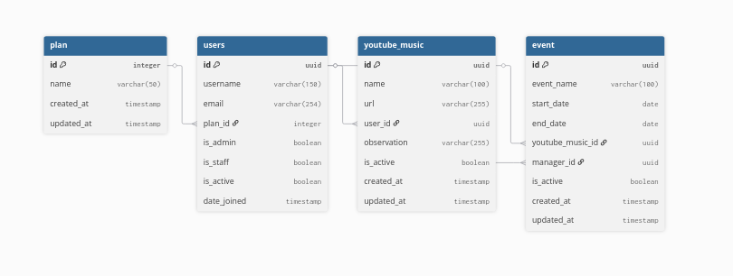

# 🎵 Documentação do Projeto SonoraAPI

Bem-vindo à documentação do backend do projeto Sonora. Esta API foi construída com **Django** e **Django REST Framework**, utilizando **JWT** para autenticação e **UUIDs** como identificadores únicos.

## 📋 Pré-requisitos

Antes de começar, certifique-se de ter instalado em sua máquina:
*   Python 3.10 ou superior
*   Pip (gerenciador de pacotes do Python)
*   Node.js (opcional, para testes com o script JS)

---
## ⚙️ Configuração do Ambiente (Servidor Django)

### 1. Clonar o repositório e configurar ambiente virtual

**No Linux / macOS:**
```bash
python3 -m venv venv
source venv/bin/activate
```

**No Windows (PowerShell):**
```powershell
# Cria o ambiente virtual
python -m venv venv

# Ativa o ambiente virtual
.\venv\Scripts\activate
```
*Nota: Se o PowerShell bloquear a execução, rode `Set-ExecutionPolicy -ExecutionPolicy RemoteSigned -Scope Process` e tente ativar novamente.*

### 2. Instalar dependências
O comando é o mesmo para todos os sistemas:
```bash
pip install -r requirements.txt
```

### 3. Configurar variáveis de ambiente
No Windows, você pode criar o arquivo `.env` usando o Bloco de Notas ou o VS Code.
1. Na raiz do projeto, crie um arquivo chamado `.env`.
2. Cole as configurações:
   ```env
   SECRET_KEY=sua_chave_secreta_aqui
   DEBUG=True
   ```

### 4. Rodar Migrações
```bash
python manage.py makemigrations sonoraAPI
python manage.py migrate
```

### 5. Criar Administrador
```bash
python manage.py createsuperuser
```
*O terminal pedirá nome de usuário, e-mail e senha. A senha não aparece enquanto você digita por segurança.*

### 6. Iniciar o servidor
```bash
python manage.py runserver
```
---

## 🤖 Testando com o Script JS (Windows)

Se você estiver usando o **VS Code no Windows**:

1. **Instalar Node.js:** Baixe a versão *LTS* em [nodejs.org](https://nodejs.org/).
2. **Preparar o ambiente:**
   Abra o terminal na pasta do projeto e rode:
   ```powershell
   npm init -y
   npm install dotenv node-fetch
   ```
3. **Executar o script:**
   ```powershell
   node example.get_users.js
   ```

---

### ⚠️ Dicas de Problemas Comuns no Windows:

*   **Comando `python` não encontrado:** No Windows, o comando pode estar mapeado como `py` em vez de `python`. Tente `py -m venv venv` se o primeiro falhar.
*   **Permissões de Script:** O Windows é rigoroso com scripts. Se ao tentar ativar o `venv` você vir um erro em vermelho sobre "Scripts desabilitados", o comando `Set-ExecutionPolicy` mencionado no passo 1 resolve isso.
*   **Caminhos:** Ao configurar o `MEDIA_ROOT` no `settings.py`, o Django no Windows lida bem com `BASE_DIR / 'media'`, mas evite usar caminhos fixos com barras invertidas (`C:\Users\...`), sempre prefira usar o `pathlib` do Django (`BASE_DIR`).
*   **Banco de Dados:** O SQLite funciona perfeitamente no Windows sem precisar instalar nenhum servidor externo. Se decidir migrar para MySQL no futuro, recomendo usar o **Docker** ou o **XAMPP** para facilitar a instalação do servidor MySQL no Windows.
---

## 🔌 Como consumir a API

A API segue o padrão RESTful. Abaixo, os principais endpoints:

### Autenticação
*   **POST** `/api/token/`: Envie `username` e `password`. Retorna o `access` (token JWT).
*   **POST** `/api/token/refresh/`: Envie o `refresh` token para obter um novo token de acesso.

### Recursos (Endpoints principais)
Para acessar estes endpoints, você deve enviar o token JWT no cabeçalho da requisição:
`Authorization: Bearer <seu_token>`

| Método | Endpoint | Descrição |
| :--- | :--- | :--- |
| `GET` | `/api/sonora/v1/users/` | Lista usuários (Admin apenas). |
| `GET` | `/api/sonora/v1/musics/` | Lista músicas do usuário logado. |
| `POST` | `/api/sonora/v1/musics/` | Cria uma nova música. |
| `GET` | `/api/sonora/v1/events/` | Lista eventos (apenas os futuros). |

---

## 🤖 Testando com o Script JS

Se você deseja testar a comunicação programaticamente, use o script `example.get_users.js`:

1. **Instalar dependências:**
   ```bash
   npm init -y
   npm install dotenv node-fetch
   ```

2. **Configurar `.env`:**
   Crie um `.env` com `API_URL`, `API_USERNAME` e `API_PASSWORD`.

3. **Executar:**
   ```bash
   node example.get_users.js
   ```

---

## 💡 Regras de Negócio Importantes

*   **Deleção Segura:** Não existe deleção física (Hard Delete). Ao deletar via API, o sistema apenas altera o status para `is_active = False`.
*   **Filtro de Eventos:** Gerentes apenas visualizam eventos cuja data (`end_date`) seja igual ou superior à data de hoje.
*   **Permissões:**
    *   **Admin:** Acesso total a tudo.
    *   **Gerente (Staff):** Pode gerenciar eventos vinculados a ele.
    *   **Usuário Comum:** Acesso restrito ao próprio perfil e músicas vinculadas.

---

**Consulte o arquivo `models.py` para ver os campos exatos de cada recurso.**


